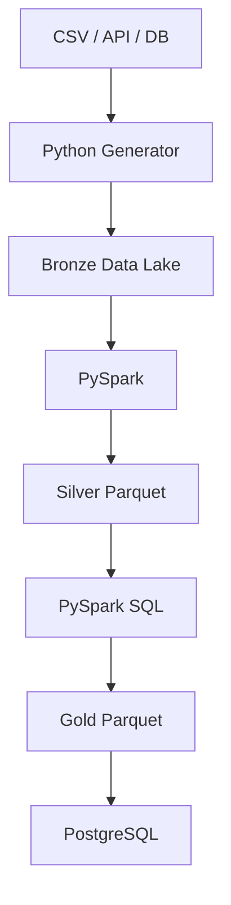
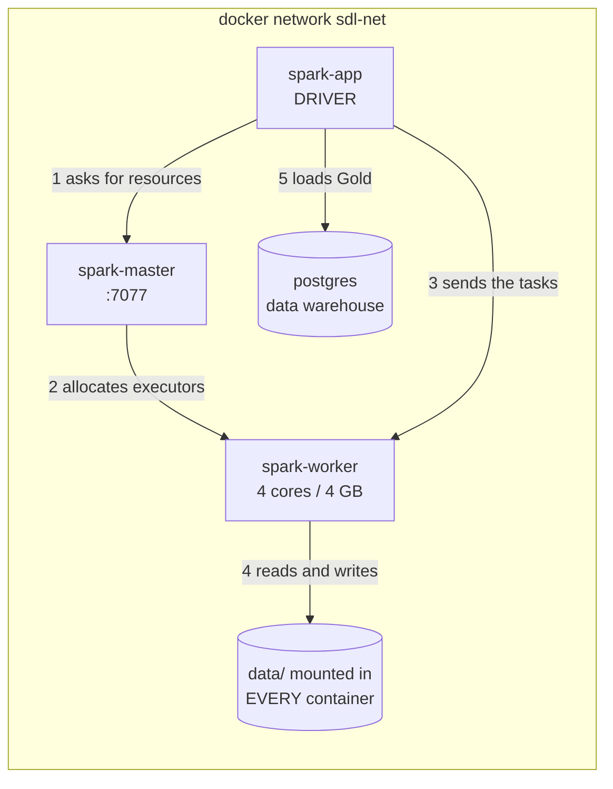

# Spark Data Lake — E-commerce Analytics Platform

> E-commerce data lake in a **Medallion** architecture (Bronze / Silver / Gold),
> built with **Apache Spark 3.5 / PySpark**, reproducible locally with **Docker**,
> and loaded into a **PostgreSQL data warehouse**.

[](https://github.com/AymanMady/spark-data-lake/actions/workflows/ci.yml)
[](https://spark.apache.org/)
[](https://www.python.org/)
[](https://www.postgresql.org/)
[](LICENSE)

The project processes a dataset of **1 million deliberately dirty orders**
(duplicates, broken emails, multi-format dates, negative quantities, orphan keys)
and produces four analytical tables ready for a dashboard.

Every number in this README was **measured** on the development machine
(8 vCPU, ~8 GB of RAM available, Spark worker capped at 4 cores / 4 GB).
None of them is an estimate. They will differ on another machine.

---

## Table of contents

1. [Project Overview](#1-project-overview) · 2. [Business Problem](#2-business-problem) ·
3. [Architecture](#3-architecture) · 4. [Medallion](#4-medallion-architecture) ·
5. [Technologies](#5-technologies) · 6. [Structure](#6-project-structure) ·
7. [Installation](#7-installation) · 8. [Docker](#8-docker) ·
9. [Generate Data](#9-generate-data) · 10. [Run Spark](#10-run-spark) ·
11. [Bronze → Silver](#11-bronze--silver) · 12. [Silver → Gold](#12-silver--gold) ·
13. [Load PostgreSQL](#13-load-postgresql) · 14. [Data Quality](#14-data-quality) ·
15. [Performance](#15-performance) · 16. [Pandas vs Spark](#16-pandas-vs-spark) ·
17. [Spark Concepts](#17-spark-concepts) · 18. [Troubleshooting](#18-troubleshooting) ·
19. [Future Improvements](#19-future-improvements)

---

## 1. Project Overview

A complete analytics platform for an e-commerce site:

- **ingestion** of raw data (customers, products, orders);
- **storage** in a data lake organised as Bronze / Silver / Gold;
- **distributed processing** with Spark (DataFrame API **and** Spark SQL);
- **exposure** of the aggregates in PostgreSQL.

A second goal, just as deliberate: understanding **when Spark is useful and when it
is not**. The benchmark in section 16 shows that on 10 MB Spark is **14.3x slower**
than Pandas — and that at 1 GB Pandas does not run at all on this machine while
Spark finishes in 115 s. Both facts matter equally.

## 2. Business Problem

An e-commerce team wants to answer four questions:

| Question | Gold table |
| --- | --- |
| What is the revenue per day? | `daily_sales` |
| Which products and categories perform? | `product_sales` |
| Who are the best customers? | `customer_sales` |
| How do sales break down by country? | `country_sales` |

The source data is large and dirty. On the reference dataset, **4.3% of the orders
are unusable** as they stand. Ignoring that would distort revenue directly; dropping
them silently would make the gap unexplainable three months later.

## 3. Architecture

### Data flow



### Execution environment



| Service | Role | Access |
| --- | --- | --- |
| `spark-master` | Registry of the workers, allocates resources. **Computes nothing.** | http://localhost:8090 |
| `spark-worker` | Provides CPU + RAM, starts 2 executors of 2 cores. | http://localhost:8091 |
| `spark-app` | Client: hosts the **driver** of the jobs. | http://localhost:4040 |
| `postgres` | Data warehouse, destination of the Gold tables. | `localhost:5440` |

> Ports are shifted (8090 / 8091 / 5440) because 8080, 8081, 8082, 5432, 5433 and
> 5434 were already taken on the development machine. Everything is configurable
> in `.env`.

## 4. Medallion Architecture

| Layer | Contents | Format | Rule |
| --- | --- | --- | --- |
| **Bronze** | Raw data, **everything as text** | Parquet | We fix nothing. We only add `_ingested_at` and `_source_file`. |
| **Silver** | Cleaned, typed, deduplicated, validated | Partitioned Parquet | One row = one usable fact. |
| **Gold** | Business aggregates | Parquet | One table = one business question. |

**Why three layers and not a single transformation?** Because a cleaning rule always
changes. Bronze keeps the data exactly as it arrived: the whole pipeline can be
replayed without asking the source for anything again.

**Why is Bronze in Parquet if "Bronze = raw"?** The rule is about the **content**,
not about the storage format. Bronze will be re-read dozens of times; keeping it as
CSV would force every read to reparse text and read every column. The content itself
stays strictly identical to the source (all `StringType`, no value corrected).

## 5. Technologies

| Tool | Version | Role |
| --- | --- | --- |
| Apache Spark | 3.5.6 | Distributed processing engine |
| PySpark | 3.5.6 | Python API |
| Python | 3.10 (container) | Language |
| OpenJDK | 17 | JVM Spark runs on |
| Parquet + Snappy | — | Columnar format of the data lake |
| PostgreSQL | 16 | Data warehouse |
| Docker / Compose | 28 / v2 | Reproducibility |
| pytest | 8.3 | Tests (41 tests) |
| Faker + NumPy | — | Realistic data generation |

## 6. Project Structure

```text
spark-data-lake/
├── data/                          # Data lake (never committed)
│   ├── raw/                       # Source CSVs
│   ├── bronze/ silver/ gold/      # Medallion layers
│   ├── quarantine/                # Rejected rows, with their reason
│   └── quality/                   # JSON data quality reports
├── src/
│   ├── generator/generate_data.py # Vectorised generator (Faker + NumPy)
│   ├── spark/
│   │   ├── spark_session.py       # SparkSession factory
│   │   ├── schemas.py             # Explicit Bronze / Silver schemas
│   │   ├── data_quality.py        # Quality rules framework
│   │   ├── utils.py               # Logging, timing, bench
│   │   ├── ingest_bronze.py       # RAW  -> BRONZE
│   │   ├── bronze_to_silver.py    # BRONZE -> SILVER
│   │   ├── silver_to_gold.py      # SILVER -> GOLD (DataFrame API + SQL)
│   │   └── demos/                 # 6 measured teaching demos
│   └── warehouse/load_postgres.py # GOLD -> PostgreSQL (JDBC)
├── benchmarks/pandas_vs_spark.py  # Real benchmark, with a memory guard rail
├── notebooks/spark_exploration.ipynb  # Interactive exploration (JupyterLab)
├── tests/                         # 41 pytest tests
├── scripts/                       # cluster smoke test + PostgreSQL check
├── docker/                        # spark-defaults.conf, log4j2, init.sql
├── Dockerfile  docker-compose.yml  Makefile  requirements.txt
└── .env.example                   # the real .env is never committed
```

## 7. Installation

Requirements: **Docker** and **Docker Compose v2**. No Spark, no Java and no PySpark
to install on the machine.

```bash
git clone <repo-url> && cd spark-data-lake
make setup     # creates .env from .env.example
# edit .env: POSTGRES_PASSWORD, and the ports if needed
make build     # builds the image (~2 min the first time)
make up        # starts the cluster
make smoke     # checks end to end that Spark works
make check-db  # checks that PostgreSQL answers
```

> **Note on local Python**: the development machine has Python 3.13, which PySpark
> 3.5 does not support. Every job and every test therefore runs **inside the
> containers**. That is the right practice anyway: the environment is identical for
> everyone.
>
> To run the test suite outside Docker, `requirements-dev.txt` pins `pyspark==3.5.6`.
> This matters: from Spark 4.0 on, ANSI mode is enabled by default and `to_timestamp()`
> raises on an unparseable string instead of returning `NULL`, which is exactly what the
> flexible date parsing in `bronze_to_silver.py` relies on.

## 8. Docker

```bash
make up        make ps        make logs       make shell
make down      make restart   make clean      make help
```

`make up` starts four services. The worker waits for the master to be `healthy`
before registering (`depends_on` + healthcheck), otherwise it would start into a void.

Expected output of `make smoke`:

```text
  Spark version         : 3.5.6
  Master                : spark://spark-master:7077
  Cores available       : 4
  Executors + driver    : 3 registered processes
  Partitions            : 4
  .parquet files        : 4 (one per partition)
  SMOKE TEST PASSED
```

Three processes = 1 driver + 2 executors. The worker has 4 cores and
`spark.executor.cores = 2`, so Spark creates **two** executors of 2 cores.

## 9. Generate Data

```bash
make generate                    # 1,000,000 orders (default)
make generate ROWS=5000000
# or directly, with more options:
docker compose exec spark-app python3 -m src.generator.generate_data \
    --preset 100mb --seed 42
```

**Generation strategy.** Faker produces about 20,000 values per second: 10 million
rows would take hours. The generator therefore builds Faker **pools** (a few thousand
names, products), then **NumPy draws from them in a vectorised way**. Measured
throughput: **54,584 orders/second** (1 M orders in 18.3 s).

This is exactly Spark's own logic: avoid row-by-row Python loops.

| Preset | Orders | CSV size |
| --- | --- | --- |
| `10mb` | 200,000 | 8.7 MB *(measured)* |
| `100mb` | 2,000,000 | 93.0 MB *(measured)* |
| `1gb` | 21,000,000 | ~1 GB |
| `10gb` | 210,000,000 | ~10 GB |

The presets are calibrated on a real measurement: 1 M orders = 49.2 MB, i.e.
~51.6 bytes per order.

**The seed guarantees reproducibility**: same seed = strictly identical dataset
(checked by a test).

### Anomalies injected on purpose

| Anomaly | Target rate | Observed on 1 M |
| --- | --- | --- |
| Duplicated rows | 1.5% | 14,560 |
| Broken emails (no `@`, spaces, uppercase) | 3.0% | yes |
| Missing country | 2.0% | yes |
| Negative, zero or absent price | 2.0% | 90 products rejected |
| Quantity `<= 0` or NULL | 1.2% | 16,210 |
| Missing foreign key | 0.6% | 12,258 |
| Orphan foreign key | 0.4% | 3,834 customers, 20,506 products |
| Absent or unreadable date | 0.5% | 4,912 |
| Dates in several formats | 10% | `2024-03-15` and `15/03/2024` |

### Simulating larger volumes

The generator writes **in batches** (`--chunk-size`), so generating 10 GB does not
require 10 GB of RAM. But let us be clear: **a local machine does not process 1 TB
efficiently**. See the [Scalability](#scalability-from-10-mb-to-1-tb) section.

## 10. Run Spark

```bash
make pipeline     # generate -> bronze -> silver -> gold -> warehouse
```

Or step by step:

```bash
make bronze       # RAW -> BRONZE
make silver       # BRONZE -> SILVER
make gold         # SILVER -> GOLD (DataFrame API)
make gold-sql     # SILVER -> GOLD (Spark SQL, identical results)
make warehouse    # GOLD -> PostgreSQL
```

### Interactive exploration

```bash
make notebook   # JupyterLab on http://localhost:8888 (the token is printed)
```

`notebooks/spark_exploration.ipynb` opens a Spark session, loads the three layers,
compares the DataFrame API and Spark SQL, inspects the partitions and plots daily
revenue. It is there to **explore**, not to produce: the production jobs stay in
`src/spark/`.

### Teaching demos

The six demos, each with its own measurements:

```bash
make demo-basics      # select, filter, withColumn, join, groupBy, orderBy
make demo-partitions  # partitions, repartition vs coalesce, data skew
make demo-lazy        # lazy evaluation, transformations vs actions, DAG, shuffle
make demo-parquet     # CSV vs Parquet, predicate pushdown, partition pruning
make demo-joins       # inner / left / anti, sort merge vs broadcast
make demo-cache       # cache, persist, and why not to overuse them
make demos            # the six in a row
```

## 11. Bronze → Silver

`make silver` runs nine steps: read, schema check, cleaning, typing, date
normalisation, validation, quarantine, deduplication, write.

**Two distinct policies**, never to be confused:

| Policy | Case | Example |
| --- | --- | --- |
| **REPAIR** | Cosmetic anomaly | broken email → `NULL`, missing country → `"Unknown"` |
| **REJECT** | Unusable row | quantity `<= 0`, unreadable date, missing primary key |

An order whose customer email is broken still counts towards revenue. An order with
no date does not.

### Result measured on 1 M orders

```text
[SILVER] Cleaning orders
[SILVER] Rows before: 1,015,000
[SILVER] Rows after : 971,453
[SILVER] Rows read    : 1,015,000
[SILVER] Rows valid   : 971,453
[SILVER] Rows invalid : 28,987
[SILVER] Rows removed : 43,547 (including 14,560 duplicates)
[SILVER] Valid ratio : 95.71%
[SILVER] Breakdown of the violated rules:
[SILVER]     quantity_positive                12,098  (1.19%)
[SILVER]     product_id_not_null               6,152  (0.61%)
[SILVER]     customer_id_not_null              6,106  (0.60%)
[SILVER]     order_date_not_null               4,912  (0.48%)
[SILVER]     quantity_not_null                 4,112  (0.41%)
```

| Dataset | Read | Valid | Ratio |
| --- | --- | --- | --- |
| customers | 50,750 | 50,000 | 98.5% |
| products | 5,075 | 4,913 | 96.8% |
| orders | 1,015,000 | 971,453 | 95.7% |

### Physical partitioning of Silver

`silver/orders` is partitioned by `order_year` / `order_month`: **24 directories,
24 Parquet files**. A `repartition()` precedes the `partitionBy()`, without which
each of the 4 Spark partitions would write one file into each of the 24 directories —
96 small files instead of 24. That is the **small files problem**.

### Referential integrity

A `LEFT ANTI JOIN` measures the orphan orders:

```text
Orders with a non-existent customer :  3,834 (0.39%)
Orders with a non-existent product  : 20,506 (2.11%)
```

The 2.11% do not come only from the generator (0.4% of injected orphans):
**rejecting 162 products in Silver orphaned the orders that referenced them**.
A cascading rejection, invisible unless you measure it.

## 12. Silver → Gold

Four tables produced:

| Table | Rows | Columns |
| --- | --- | --- |
| `daily_sales` | 730 | date, orders_count, total_quantity, total_revenue, average_order_value |
| `product_sales` | 4,913 | product_id, product_name, category, orders_count, quantity_sold, revenue |
| `customer_sales` | 40,052 | customer_id, orders_count, total_spent, average_order_value |
| `country_sales` | 17 | country, orders_count, revenue |

The enriched fact table (orders + prices + countries) holds **947,194 rows**:
24,259 Silver orders are lost by the `INNER JOIN`s with the dimensions.
**An inner join is a filter in disguise** — it is the number one cause of numbers
that do not add up.

Only the `delivered` and `shipped` statuses count towards revenue. A cancelled order
exists, keeps its quantity, but brings in 0.

### DataFrame API and Spark SQL

```bash
make gold      # DataFrame API
make gold-sql  # Spark SQL on temporary views
```

The two engines were compared row by row: **strictly identical results** on the 4
tables (730 / 4,913 / 40,052 / 17 rows). That is expected: both go through the **same
Catalyst optimiser** and produce the same physical plan. The choice is a matter of
readability and team skills, not of performance.

> **A real bug hit while building this project.** The first comparison revealed a gap
> of 0.01 EUR on 449 customers out of 40,052. Cause: the DataFrame version computed
> `average_order_value` from the **already rounded** revenue (double rounding), while
> the SQL divided the raw sum. The SQL was right. Fixed, and locked in by a
> regression test.

## 13. Load PostgreSQL

```bash
make warehouse
make psql      # SQL console
```

```text
[WAREHOUSE] Loading PostgreSQL: gold.daily_sales (730 rows, 2 connections, mode=overwrite)
[WAREHOUSE] 4 tables loaded, 45,712 rows in total.
```

```sql
SELECT country, orders_count, revenue FROM gold.country_sales ORDER BY revenue DESC LIMIT 3;
--     country     | orders_count |   revenue
-- ----------------+--------------+-------------
--  France         |       213297 | 16604994.21
--  Germany        |       129056 | 10005393.11
--  United Kingdom |       100248 |  7751325.96
```

### Data lake vs data warehouse

| | Data lake (`data/`, Parquet) | Data warehouse (PostgreSQL) |
| --- | --- | --- |
| Contents | **everything**, including the unused | the **result**, modelled |
| Schema | schema-on-**read** | schema-on-**write** |
| Cost per GB | very low | high |
| Designed for | massive processing (Spark) | concurrent queries, BI |
| Bad at | 500 small queries/second | storing 50 TB of raw logs |

So we load **Gold only**: 45,712 aggregated rows, which Metabase or Power BI will
read in milliseconds.

**Why Spark and not `pandas.to_sql`?** Spark writes **in parallel**: each partition
opens its own JDBC connection (`numPartitions` controls how many). The indexes are
created **after** the load: maintaining an index during a bulk insert slows it down
badly.

No credential is hard-coded: everything comes from `.env`, and `.env` is in
`.gitignore`.

## 14. Data Quality

An invalid row is **never** deleted silently. It is:

1. **counted** per rule;
2. **isolated** in `data/quarantine/<dataset>/` with the reason for the rejection;
3. **traced** in a timestamped JSON report (`data/quality/`).

```json
{
  "dataset": "orders",
  "rows_read": 1015000,
  "rows_valid": 971453,
  "rows_invalid": 28987,
  "rows_duplicated": 14560,
  "valid_ratio": 0.957097,
  "failures_by_rule": {
    "order_id_not_null": 0,
    "customer_id_not_null": 6106,
    "product_id_not_null": 6152,
    "quantity_not_null": 4112,
    "quantity_positive": 12098,
    "order_date_not_null": 4912,
    "status_valid": 0
  }
}
```

A guard rail (`--min-valid-ratio`, default 0.80) **stops the pipeline** if quality
collapses, rather than propagating a broken dataset all the way to the dashboard.

### The NULL trap in SQL

```python
Rule("quantity_positive", F.col("quantity") > 0)
```

In SQL, `NULL > 0` is **not** `False`: it is `NULL`. Without care, a missing quantity
would trigger **no** rule at all and would pass as valid. The framework therefore
forces `NULL → False`:

```python
def _safe(condition):
    return F.coalesce(condition, F.lit(False))
```

This is the most important test of the suite (`test_a_null_condition_counts_as_invalid`).

### A single pass over the data

Counting the violations rule by rule would trigger as many reads as there are rules.
The framework builds a `_dq_errors` column (an array of the violated rules) then
aggregates every counter in **one single action**.

## 15. Performance

The method applied to each optimisation: (1) the problem, (2) the naive version,
(3) the optimised version, (4) the measurement, (5) the trade-off.
**No premature optimisation**: every gain below is measured, not assumed.

### Partitions — `make demo-partitions`

Same computation (sum of quantities), three configurations:

| Configuration | Time |
| --- | --- |
| 4 partitions (natural read) | **0.96 s** |
| 1 partition (`coalesce(1)`, single-threaded) | 1.21 s |
| 64 partitions (`repartition(64)`) | 2.29 s |

**There is an optimum, and it is not "as many as possible".** Too few: no
parallelism. Too many: scheduling costs more than the computation.

| | `repartition(n)` | `coalesce(n)` |
| --- | --- | --- |
| Shuffle | **yes**, full | **no** |
| Can increase | yes | **no** (silently ignored) |
| Balancing | perfect (x1.0 measured) | approximate (x1.4 measured) |
| Use for | increasing / rebalancing | reducing before a write |

`repartition("status")` groups by key but exposes the **data skew**: an imbalance of
**x5.7** measured, with `delivered` accounting for 62% of the rows.

### Shuffle and AQE — `make demo-lazy`

| Configuration | Time |
| --- | --- |
| AQE off, `shuffle.partitions = 8` | **1.32 s** |
| AQE off, `shuffle.partitions = 200` | 4.24 s (**+220%**) |
| AQE on, `shuffle.partitions = 200` | **0.43 s** (−90%) |

200 is **Spark's default**, designed for a production cluster. Locally it creates 200
tiny tasks. But since Spark 3.2, **AQE merges the too-small partitions after the
fact** and recovers most of the bad setting. Tuning by hand is still useful, it is
simply no longer the magic lever it used to be.

### Parquet — `make demo-parquet`

| Operation | CSV | Parquet | Gain |
| --- | --- | --- | --- |
| Storage (same data) | 45.6 MB | 18.7 MB | **x2.4** |
| Full `count()` | 1.18 s | 0.74 s | x1.6 |
| Sum of **one** column out of 6 | 1.85 s | 0.96 s | x1.9 |
| With a selective filter | 0.62 s | 0.28 s | **x2.2** |
| Partition pruning (1 month out of 24) | 0.51 s | 0.36 s | x1.4 |

> **Honesty about these numbers.** 45 MB is small: the file fits in the OS disk cache
> and Spark's fixed costs dominate. Partition pruning does not give x24 for the same
> reason. On 500 GB those fixed costs become negligible and the gains tend towards
> the theoretical ratio.

**Counter-intuitive finding**: the physical plan for CSV also shows `PushedFilters`.
That is accurate since Spark 3.0, but the term covers two very different mechanisms:

- **CSV**: Spark still reads **every byte** to find the line endings; the filter only
  saves it from converting the remaining columns. Gain: CPU.
- **Parquet**: min/max statistics per row group make it possible to **not read the
  block at all**. Gain: whole disk I/Os.

That is why the CSV/Parquet gap goes from **x1.0 without a filter to x2.2 with one**.

### Broadcast join — `make demo-joins`

`orders` (971,453 rows, 18.7 MB) joined to `products` (4,913 rows, 65.8 KB):

| Strategy | Shuffles | Measured time |
| --- | --- | --- |
| `SortMergeJoin` (default without broadcast) | 2 | 1.88 s |
| `BroadcastHashJoin` | 0 | **0.58 s** |

Spark broadcasts **on its own** below `spark.sql.autoBroadcastJoinThreshold` (10 MB
by default). The `F.broadcast()` hint is for when the estimate is wrong, when the
table exceeds the threshold but still fits in memory, or to make the intent explicit.

**Do not broadcast** a table of several hundred MB: the driver collects it
**entirely** in memory, then copies it to **every** executor. 200 MB x 50 executors =
10 GB consumed. Typical symptom: a stage stuck on 1 task, then the driver dying with
`OutOfMemoryError`.

### Cache — `make demo-cache`

Four aggregations on the same fact table (947,194 rows, two joins):

| | Time |
| --- | --- |
| Without cache (4 full recomputations) | **34.32 s** |
| Materialising the cache | 8.59 s |
| The 4 aggregations, cached | **3.68 s** |
| **Total with cache** | **12.27 s** (**−64%**) |

On the aggregations alone: **−89%**.

To check that the cache is really used: look for **`InMemoryTableScan`** in the plan.

**Why `cache()` everywhere is bad practice:**

1. memory is **shared with execution** — the cache steals RAM from the shuffles,
   which then spill to disk; the job becomes **slower**;
2. when memory is full, Spark **evicts** in LRU order: you pay for the write without
   ever benefiting from the re-read;
3. a DataFrame read **only once** has nothing to gain — measured in the demo: the
   cache costs time and returns nothing;
4. the cache **freezes** a result: if the sources change, it silently becomes wrong.

**Rule**: cache only what is (1) reused at least twice, (2) expensive to recompute,
(3) of reasonable size. And **always** `unpersist()`.

### Order of the optimisations, from most to least profitable

1. **Read less**: Parquet, column pruning, partition pruning.
2. **Filter early**: reduce the volume before the joins.
3. **Avoid shuffles**: broadcast the small dimensions.
4. **Tune the partitions**: neither too many nor too few.
5. **Cache** what is genuinely reused.

Starting with point 5 is the most widespread mistake.

### Reading an execution plan

```python
df.explain("formatted")
```

| What to look for | Meaning |
| --- | --- |
| `Scan parquet` / `FileScan` | Read. Look at `ReadSchema` (column pruning). |
| `PushedFilters` | Filters pushed down into the format. |
| `PartitionFilters` | Whole directories skipped (partition pruning). |
| `Exchange` | **A shuffle.** Boundary between two stages. Count them. |
| `BroadcastHashJoin` | Join without a shuffle. |
| `SortMergeJoin` | Join with 2 shuffles + a sort. |
| `HashAggregate` | Aggregation (often two: partial then final). |
| `InMemoryTableScan` | The cache is being used. |
| `Batched: true` | Vectorised read (Parquet). `false` for CSV. |

### Scalability from 10 MB to 1 TB

| Volume | What changes |
| --- | --- |
| **10 MB** | Spark is **useless**: 14.3x slower than Pandas (measured). A single core is enough. |
| **10 GB** | Spark becomes relevant. No longer fits in RAM on a laptop. ~80 partitions of 128 MB. Parquet mandatory. The shuffle spills to disk. |
| **100 GB** | One machine is no longer enough. Cluster of 5 to 10 nodes. The **network** becomes the bottleneck: avoiding shuffles beats everything else. Partitioning by date is essential. zstd compression worth considering. |
| **1 TB** | Several dozen nodes, **object** storage (S3/GCS) rather than local. **Incremental** processing mandatory: you do not reprocess 1 TB every night. Delta Lake / Iceberg for transactions. Data skew = problem number one (salting, AQE skew join). |

**A local machine does not process 1 TB efficiently**, and this project does not claim
otherwise. What changes as the volume grows:

- **partitions**: aim for 100–200 MB per partition, so their number grows linearly;
- **memory**: per executor, not global — 4 to 8 GB per executor stays the norm;
- **CPU**: 2 to 5 cores per executor; beyond that, disk accesses get in each other's way;
- **workers**: it is **them** you multiply, not the size of each one;
- **storage**: local filesystem → HDFS → object storage;
- **shuffle**: from expensive to **dominant**; it is the main optimisation axis;
- **network**: invisible locally, the limiting factor on a cluster;
- **format**: Parquet everywhere, then Delta/Iceberg for ACID and time travel;
- **compression**: snappy (fast) → zstd (more compact) when I/O dominates CPU.

## 16. Pandas vs Spark

The same processing on both sides: **read a CSV → clean → aggregate by day**.
`make bench`

| Step | CSV | Pandas | PySpark | Pandas peak RAM | Verdict |
| --- | --- | --- | --- | --- | --- |
| 10 MB | 8.7 MB | **1.50 s** | 21.53 s | 97.7 MB | Spark **x14.3 slower** |
| 100 MB | 93.0 MB | **9.95 s** | 14.63 s | 920.4 MB | Spark **x1.5 slower** |
| 1 GB | 1.0 GB | **impossible** | **114.94 s** | — | **Pandas cannot do it** |

What these numbers say:

- **Spark is not "faster"**. On 10 MB it is 14x slower: JVM startup, planning,
  scheduling, Python↔JVM serialisation. Those costs are **fixed**: you pay them
  whether the file is 10 MB or 10 GB.
- **Pandas does not scale in memory.** A **x10 measured** factor between the file and
  the RSS peak (93 MB → 920 MB), because every text value becomes a Python object
  with some fifty bytes of header.
- **At 1 GB, Pandas stops.** It would need about 10 GB of RAM while the machine only
  has ~5.5 GB available. The benchmark **refuses to run it** and says so, rather than
  making the system swap for twenty minutes. Spark processes the same file in
  **115 s** within 2 GB per executor: it reads by partitions and spills to disk
  instead of collapsing.
- **Pandas' time grows with the data, Spark's much less.** From 10 MB to 100 MB:
  Pandas x6.6, Spark x0.7. The crossover sits around a few hundred MB on this machine.

**This is exactly the boundary the project set out to show.** It is not that Spark is
better: it is that it does something Pandas cannot do at all.

**Honest conclusion**: for a 50 MB CSV, take Pandas — it will be 10x faster and 10
times simpler. For a dataset that does not fit in RAM, or for a pipeline that has to
grow, take Spark.

## 17. Spark Concepts

### Partition

> A partition is a chunk of the data processed by **one** task, on **one** core.
> It is Spark's unit of parallelism. `df.rdd.getNumPartitions()` gives their count.

Spark does not pick it at random:
`maxSplitBytes = min(maxPartitionBytes, max(openCostInBytes, totalSize / cores))`.

### Transformation

> A transformation **describes** an operation without running the computation.
> `select`, `filter`, `withColumn`, `join`, `groupBy`, `repartition`...

### Action

> An action actually **triggers** the execution.
> `show`, `count`, `collect`, `write`, `take`, `toPandas`...

**How to tell them apart**: look at the return type. A `DataFrame` → transformation.
A value (int, list, None) → action.

### Lazy Evaluation

> Spark first builds an execution plan and computes only when an action is called.

Measured in the demo: 5 chained transformations on ~950,000 rows take **176 ms**,
then a single `count()` takes **4.31 s**. The ratio (x24) proves nothing had been
computed.

This is not laziness, it is an **optimisation**: by waiting, Spark sees the whole
query and can merge the filters, push them before the read, read only the useful
columns, and drop the columns that are never consumed. An engine that executed
immediately could perform **none** of those optimisations.

### Shuffle

> A shuffle is the redistribution of the data between partitions. It is almost always
> the slowest operation in a job.

```text
Before: the rows of one key are SCATTERED across every partition
   |
   v  each task writes intermediate files to DISK (shuffle write)
   |
   v  the tasks of the next stage READ them over the NETWORK (shuffle read)
   |
After: every row of one key is on the SAME partition
```

Cost: serialisation + disk write + network transfer + deserialisation.

### Narrow vs Wide

> **Narrow**: each output partition depends on **exactly one** input partition.
> No network exchange. → `filter`, `select`, `withColumn`
>
> **Wide**: one output partition depends on **several** input partitions.
> → `groupBy`, `join`, `distinct`, `orderBy`, `repartition`

### Job, Stage, Task

> **Job**: triggered by an action.
> **Stage**: a portion of a job with no shuffle. The boundary between two stages is
> **always** a shuffle.
> **Task**: one partition processed by one core. Number of tasks = number of partitions.

### DAG and Catalyst

```text
read parquet (narrow) → filter (narrow) → withColumn (narrow)   ] STAGE 1
                          === SHUFFLE (Exchange) ===
                       groupBy (wide) → write (action)          ] STAGE 2
```

Catalyst turns the query into four steps:
**logical plan** (what you wrote) → **optimised logical plan** (filters merged and
lifted, useless columns dropped) → candidate **physical plans** (which join
strategy?) → the **physical plan** chosen, from a cost model.

`df.explain()` shows the physical plan; `explain("formatted")` details it node by node.

### DataFrame vs RDD

| | RDD | DataFrame |
| --- | --- | --- |
| Level | low (collection of objects) | high (table with a schema) |
| Optimisation | **none** — Spark cannot see the content | **Catalyst** optimises |
| Python | slow (serialisation on every row) | fast (runs inside the JVM) |
| When | fine-grained control, unstructured data | **99% of cases** |

A Python UDF brings the drawbacks of the RDD back into a DataFrame: every row is
serialised to a Python interpreter, and Catalyst goes blind. Always prefer the native
functions (`pyspark.sql.functions`).

### Driver, Master, Worker, Executor

> **Driver**: holds your Python code, builds the plan, distributes the work.
> **Master**: resource manager of the cluster. Computes nothing.
> **Worker**: a machine that makes its resources available.
> **Executor**: a JVM process started on a worker. **This is what computes.**

### The eleven questions this project answers

| Question | Short answer | Proof in the project |
| --- | --- | --- |
| Why Spark? | When the data exceeds one machine's RAM | § 16, Pandas impossible at 1 GB |
| Why Parquet? | Columnar, compressed, typed, with statistics | § 15, x2.4 in size, x2.2 with a filter |
| Why a data lake? | Keep the raw data so you can replay | § 4 |
| Why partitions? | They are the unit of parallelism | `make demo-partitions` |
| What is a shuffle? | Redistribution of the data, disk + network | § 17 |
| Lazy evaluation? | Plan first, compute on the action | 176 ms vs 4.31 s |
| Transformation vs action? | Return type: DataFrame vs value | `make demo-lazy` |
| DataFrame vs RDD? | Catalyst optimises the former, not the latter | § 17 |
| repartition vs coalesce? | Shuffle + can increase / no shuffle + reduces | § 15 |
| When a broadcast join? | Small dimension (< 10 MB) vs large fact table | 1.88 s → 0.58 s |
| Is Spark useless on a small dataset? | Yes: fixed costs are not amortised | **x14.3 slower on 10 MB** |

## 18. Troubleshooting

| Symptom | Likely cause | Fix |
| --- | --- | --- |
| `port is already allocated` | Another container holds the port | Change the port in `.env`, then `make down && make up` |
| Worker missing from http://localhost:8090 | The worker started before the master | `make restart`, then `make logs-worker` |
| `FileNotFoundException` on a file that exists | The `./` volume is not mounted in the **worker** | Check the `volumes` section of `spark-worker` |
| `Permission denied` in `data/` | `HOST_UID`/`HOST_GID` do not match | `id -u`, `id -g`, adjust `.env`, `make build` |
| `Initial job has not accepted any resources` | No cores/RAM left on the worker | An application holds the cluster: `make restart` |
| `WARN DataSource: All paths were ignored` | The path starts with `_` or `.` | Rename the folder — Spark ignores those prefixes (`_SUCCESS`, `_temporary`) |
| A different partition count on every run | The driver does not wait for every executor | Already fixed: `spark.scheduler.minRegisteredResourcesRatio = 1.0` |
| `Python in worker has different version` | Driver and executors on different images | One single image for the 3 roles (see `Dockerfile`) |
| Driver `OutOfMemoryError` on a join | Broadcast of a table that is too big | Remove `F.broadcast()`, or lower `autoBroadcastJoinThreshold` |
| A stage dragging on 1 task | **Data skew** | `rows_per_partition()` to confirm, then salting or AQE skew join |
| `ModuleNotFoundError: pyspark` with `python3` | Incomplete `PYTHONPATH` | Already fixed in the image (`/opt/spark/python` + py4j) |
| Slow tests | One SparkSession per test | The fixture is `scope="session"` |
| `CANNOT_PARSE_TIMESTAMP` running the tests on the host | PySpark 4.x enables ANSI mode by default | Install `requirements-dev.txt`, which pins `pyspark==3.5.6` |
| `RejectedExecutionException` after `spark.stop()` | Benign race when the standalone driver shuts down | None: the job is already finished and the results written |

## 19. Future Improvements

- **Delta Lake or Apache Iceberg**: ACID transactions, `MERGE INTO`, time travel,
  schema evolution — what a raw Parquet data lake lacks most.
- **Incremental processing**: reprocess only the modified partitions, instead of
  re-reading the whole of Bronze on every run.
- **Airflow orchestration**: dependencies between jobs, retries on failure, scheduling.
- **S3/MinIO object storage** instead of the local filesystem, for real storage shared
  between nodes.
- **Spark History Server**: analyse **finished** jobs, not only the running ones.
- **Great Expectations**: replace the home-made quality framework with a standard
  tool, with generated documentation.
- **Streaming**: Structured Streaming to move from the nightly batch to near real time.

---

## What was learned building this project

Four real problems hit, all documented in the code:

1. **Double rounding** — the average computed on an already rounded total gave a
   one-cent gap on 449 customers. Caught by comparing the DataFrame API and Spark SQL.
2. **Asynchronous executor startup** — the partition count varied from one run to the
   next, making any benchmark incomparable.
3. **`np.char` on an empty array** — the generator crashed on small volumes. Caught by
   a test, not by a run.
4. **`PushedFilters` on CSV** — the claim "CSV cannot filter at the source" was wrong.
   The execution plan contradicted it; the text was corrected and backed by a
   measurement.

---

## License

MIT — see [LICENSE](LICENSE).
